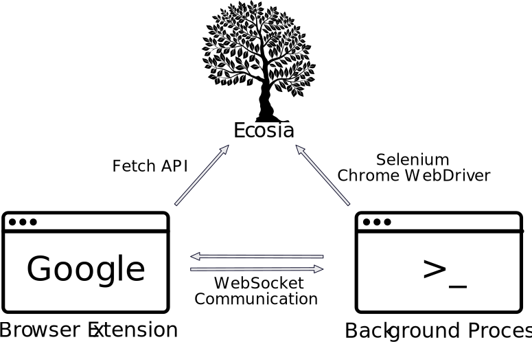

<h1>ecosia-postloader</h1>

Chrome extension to issue Ecosia search queries after Google ones were submitted.

    <a href="#core-idea">Core Idea</a> •
    <a href="#Architecture">Architecture</a> •
    <a href="#additional-features">Additional Features</a> •
    <a href="#support">Platform Support</a> •
    <a href="#browser">Browser Support</a> •
    <a href="#installation">Installation</a> •
    <a href="#run-manually">Run Manually</a>

## About This Project
### Core Idea
The idea of utilizing ad revenue to plant trees is undoubtedly a revolutionary concept since climate change has become a serious problem.
Unfortunately, this upside of Ecosia is pretty quickly getting outweighed in the real world by its less effective search algorithms as compared to Google.
This encourages a substantial amount of people potentially belonging to its userbase to eventually returning to Google not making the permanent switch.

But what if it was possible to get the best of both worlds?

This project aims on providing the search results of a conventional Google search to the user while generating ad revenue for Ecosia in the best case or at least supporting its attractiveness to advertisers in the worst case.
For achieving this goal, ecosia-postloader intercepts Google search queries using a browser extension, builds the equivalent Ecosia search query and eventually issues it via a Selenium Chrome WebDriver in the background.
This ensures that the ad-networks can not distinguish the request from a real one and serve their ads as a consequence. 

Due to the Selenium driver being very resource heavy, a simple http request with a real user-agent is issued instead if the operating device of the user is not currently charging. 
If proceeded differently, the user could experience his battery discharging rapidly, but on the flipside, when not using the Selenium approach it is questionable whether Ecosia would load ads.

### Architecture

    

Prior to sending requests from the Selenium WebDriver, the host process has to be up and running. 
After init.py was run (see [Installation](#installation)) this should take place automatically when the trigger process is launched.

If the user issues a Google search request with the browser extension enabled and the host server running:
1. Extension registers the query and builds the ecosia equivalent
2. Extension emits Ecosia query to the host via a WebSocket channel
3. Extension issues GET request to Ecosia URL using the fetch API
4. Host initiates Selenium to build headless Chrome instance
5. WebDriver issues GET request to Ecosia URL using the Chrome instance
6. WebDriver clicks on predefined number of ads on served page and stays on them for fixed amount of time
7. WebDriver terminates, host responds to extension with clicked links

### Additional Features

* Battery Mode: If operating device is not charging, Selenium WebDriver is disabled
* Rate Limit Detection: If being rate limited, disable all requests for 24 hours. Selenium WebDriver Requests permanently restricted to 1 concurrent connection and minimum time of 1s between requests
* Clicked Ads Log: Extension provides log about all ads clicked during the last search request

## Support

While the browser extension is platform independent, the automatic startup of the WebSocket server on trigger process launch is not.

| Platform      |                        |
| ------------- |-------------           |
| MacOS         | ✔️ Supported           |
| Windows       | ➖ In development      |
| Linux         | ❌ Not scheduled       |

### Browser
Any browser based on the [Chromium project](https://www.chromium.org/Home), such as Google Chrome, Brave or Edge.

## Requirements
Only tested version numbers are listed.

* [Node.js](https://nodejs.org/en/) (`15.4.x`)
* [Python](https://www.python.org/downloads/) (`3.9.x`)

## Setup
### Installation
Note, that for at least MacOS the terminal has to be privileged to manipulate the file system.
1. Clone the repository
2. Open shell/terminal/cmd and navigate to the directory
3. Run `python3 init.py`
4. Run `npm install` inside `extension/`
5. Open the chromium-based browser of your choice and navigate to the extensions page (usually found under `{browser}://extensions`)
6. Enable the developer mode and click on `load unpacked extension`
7. Upload the extension stored in `extension/` from project root

### Run Manually
After having followed the instructions above, the host application should start autonomously as soon as the specified trigger was launched.

For development purposes however, it is also possible to directly run `npm start` inside `host/` in order to start the WebSocket server.

Note that the extension might has to be reloaded as well when frequently stopping and starting the server.